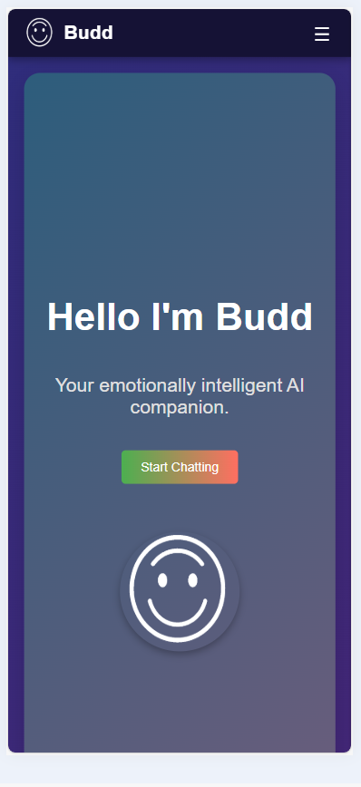
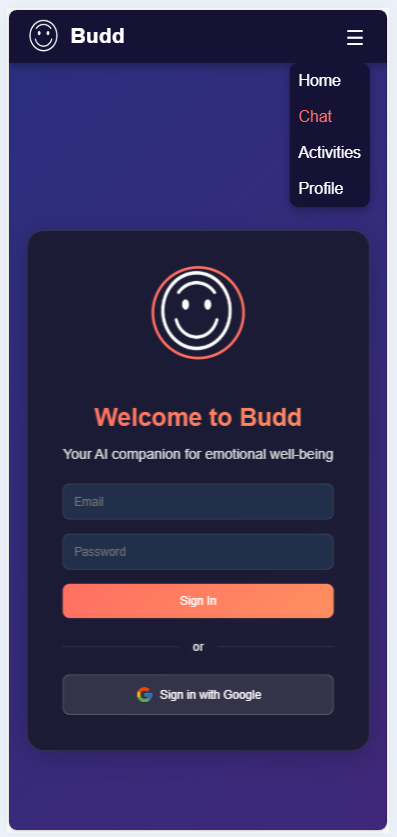

# 🤖 Budd

> Your emotionally intelligent AI companion, powered by Gemini Pro


[](https://opensource.org/licenses/MIT)
[](https://reactjs.org/)
[](https://nodejs.org/)

📱 App Screenshots
https://buddai.chat
<div align="center">
  <div style="display: flex; gap: 20px; justify-content: center;">
    
     
  </div>
</div>

## ✨ Features

- 💬 Real-time AI chat with context awareness
- 🎯 Personalized activity recommendations
- 📊 Mood tracking and insights
- 🔐 Secure Google authentication
- 💫 Modern, responsive UI with animations

## 🛠️ Tech Stack

- **Frontend**: React, Framer Motion, Firebase Auth
- **Backend**: Node.js, Express
- **Database**: Firestore
- **AI**: Gemini Pro
- **Authentication**: Firebase

## 🚀 Quick Start

### Prerequisites

- Node.js 18.x
- npm/yarn
- Firebase account
- Gemini Pro API key

### Installation

1. Clone the repo
```bash
git clone https://github.com/MfFischer/BudAi.git
cd budai
```

2. Install dependencies
```bash
# Install frontend dependencies
cd frontend && npm install

# Install backend dependencies
cd ../backend && npm install
```

3. Environment setup

```bash
# Frontend (.env)
REACT_APP_FIREBASE_API_KEY=
REACT_APP_FIREBASE_AUTH_DOMAIN=
REACT_APP_FIREBASE_PROJECT_ID=
REACT_APP_FIREBASE_STORAGE_BUCKET=
REACT_APP_FIREBASE_MESSAGING_SENDER_ID=
REACT_APP_FIREBASE_APP_ID=

# Backend (.env)
PORT=5000
GEMINI_API_KEY=
```

4. Start development servers
```bash
# Frontend (localhost:3000)
cd frontend && npm start

# Backend (localhost:5000)
cd backend && npm run dev
```

## 📁 Project Structure

```
budai/
├── frontend/
│   ├── public/
│   │   ├── images/
│   │   └── index.html
│   └── src/
│       ├── components/
│       │   ├── Home.js
│       │   ├── Chat.js
│       │   ├── Profile.js
│       │   └── Activities.js
│       ├── contexts/
│       │   └── AuthContext.js
│       ├── firebase.js
│       └── App.js
└── backend/
    ├── routes/
    ├── firebase-key.json
    └── server.js
```

## 🔧 Configuration

### Firebase Setup

1. Create a Firebase project
2. Enable Authentication (Google provider)
3. Create Firestore database
4. Download service account key
5. Add to `backend/firebase-key.json`

### Gemini Pro Setup

1. Get API key from Google AI Studio
2. Add to backend `.env`

## 🤝 Contributing

1. Fork it
2. Create feature branch (`git checkout -b feature/awesome`)
3. Commit changes (`git commit -am 'feat: add awesome'`)
4. Push (`git push origin feature/awesome`)
5. Open Pull Request

## 📝 License

MIT © Maria Fe Fischer
